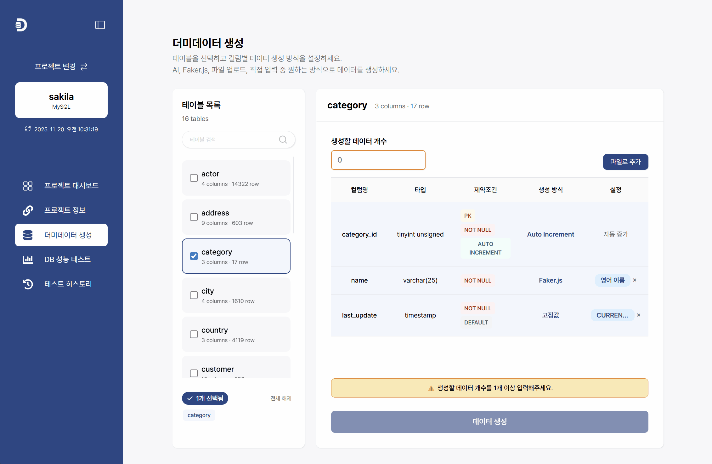
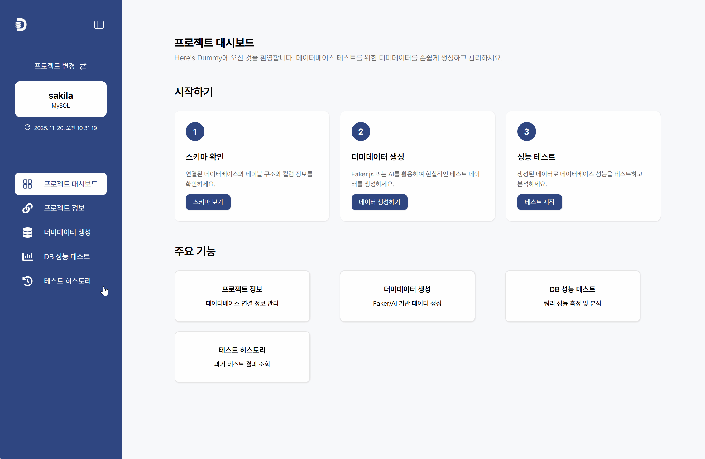
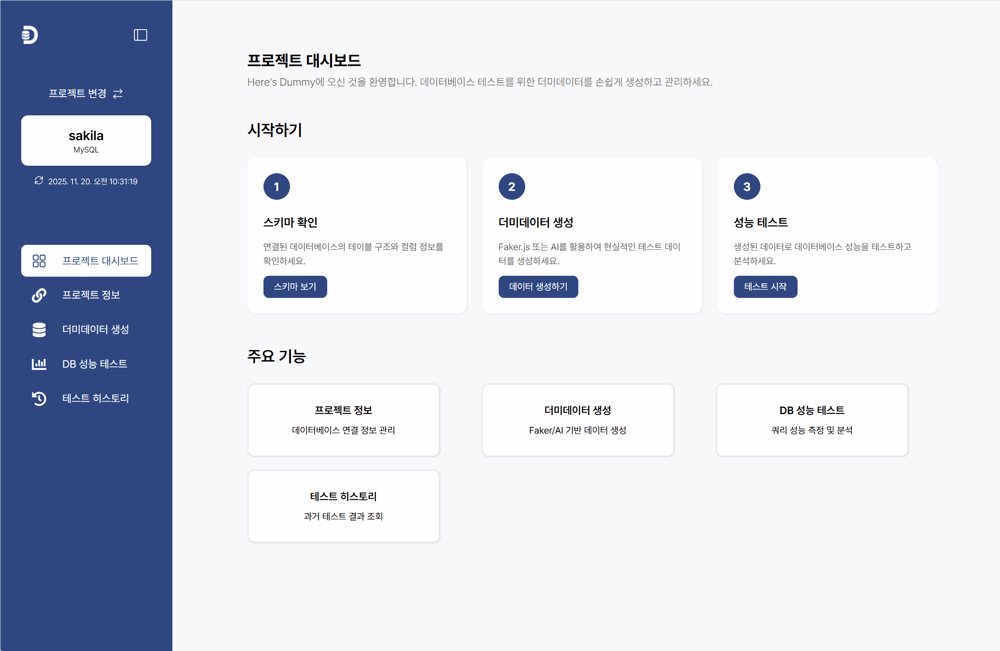

#  Here's Dummy <small> - Your Time-Saving DB Partner</small>

<p align="center">
  <a href="README.md">🇰🇷 Korean</a> • <a href="README.en.md">🇺🇸 English</a>
</p>

<p align="center">
 <a href="https://heresdummy.co.kr/">🌐 Website - open-source</a> 
</p>

<p align="center">
  <a href="./LICENSE">
    
  </a>
  <a href="https://github.com/yuja201/here-is-dummy/releases">
    
  </a>
  <a href="https://www.buymeacoffee.com/heresdummy">
    
  </a>
</p>

<br/>

## Table of Contents

- [Introduction](#-introduction)
- [Key Features](#-key-features)
- [Getting Started](#-getting-started)
- [User Guide](#-user-guide)
- [Tech Stack](#️-tech-stack)
- [Developer Guide](#-developer-guide)
- [Advanced Configuration](#️-advanced-configuration)
- [Contributing](#-contributing)
- [License](#-license)
- [Contact & Support](#-contact--support)

<br/>

## 📌 Introduction

<strong>Here’s Dummy</strong> is a desktop application that automatically analyzes database schemas and utilizes AI or Faker.js to generate realistic, high-volume dummy data. It allows you to quickly secure the necessary data during development and testing phases, significantly boosting productivity.

**[➡️ Visit Landing Page](https://heresdummy.co.kr/)**

<br/>

## ✨ Key Features

Here's Dummy maximizes productivity for developers and testers in two main areas: **Data Generation** and **Performance Testing**.

### 1. Intelligent Dummy Data Generation

- `Schema Auto-Analysis`: Automatically analyzes table structures, constraints, and relationships (FK).
- `Multi-Database Support`: Supports connection to various DBs like **MySQL and PostgreSQL**.
- `High-Speed Generation`: Capable of generating and inserting **100,000 records** in approximately **10 seconds** using Faker.js.
- `AI-Powered Generation`: Utilizes **GPT, Claude, and Gemini** to generate smart, contextually relevant data.
- `File-Based Conversion`: Upload **CSV, TXT, or JSON** files to convert and insert data matching the DB structure.

### 2. DB Performance & Stability Test (New Feature Highlight!)

- `Index Test`: Analyzes the effectiveness of your database indexes.
- `User Query Test`: Measures and evaluates SQL query performance.
- `Test History`: View and compare past test results.

<br/>

## 🚀 Getting Started

### Download & Install

Get the latest release from the [Releases page](https://github.com/yuja201/here-is-dummy/releases).

- Run the installer: `heresdummy-setup.exe`

<br/>

## 📖 User Guide

### 1️⃣ Create Project & Connect DB

Click the `+` button to create a project and enter connection details for MySQL, PostgreSQL, etc. You can check the status in advance via `Test Connection`.

<p align="center">
  
</p>

<br/>

### 2️⃣ Check Schema & Set Data Rules

Once the DB is connected, the table list is automatically analyzed and displayed. Select a table and set the desired generation method for each column: **Faker (Random), AI (Intelligent), or File Upload**.

<p align="center">
  
</p>

<br/>

### 3️⃣ Generate & Insert Data

Enter the number of rows to generate and click the `Generate Data` button. The result can be `Exported to SQL File` or `Inserted Directly into DB`.

<p align="center">
  
</p>

<br/>

### 4️⃣ Index Test

Click the `Start Test` button in the **Index Test** tab to analyze the efficiency of your database indexes.

Indexes are classified as **Normal**, **Recommended**, or **Critical**. Indexes marked as Recommended or Critical will display issues along with improvement suggestions. Try deleting unused or inefficient indexes.

<p align="center">
  
</p>

<br/>

### 5️⃣ User Query Test

In the **User Query Test** tab, click `Start Test`, enter the SQL you want to test, set the execution count and timeout, and proceed.

**Syntax Validation** ensures the query is valid before running. (Validation is also performed automatically upon start).

The results provide **Average Response Time**, **P50**, **P95** distributions, and **Explain Plan** analysis to visualize how the query is executed.

<p align="center">
  
</p>

Click the **AI Response Generation** button to get optimization recommendations. Improve complex queries (like Subqueries and Joins) and add necessary indexes based on the advice.

<p align="center">
  
</p>

<br/>

### 6️⃣ Test History

You can view past test logs in the **Test History** tab. Compare results and use them for your portfolio or performance reports.

<p align="center">
  
</p>

<br/>

## 🛠️ Tech Stack

- **Core**: Electron, React, TypeScript, Vite
- **Database**: mysql2, pg
- **Data Generation**: @faker-js/faker, openai, @anthropic-ai/sdk, @google/generative-ai
- **State Management**: zustand

<br/>

## 💻 Developer Guide

### Requirements

- Node.js 18+
- npm or yarn

### Run Locally

```bash
# 1. Clone the repository
git clone [https://github.com/yuja201/here-is-dummy.git](https://github.com/yuja201/here-is-dummy.git)
cd here-is-dummy

# 2. Install dependencies
npm install

# 3. Set up .env file
cp .env.example .env
# Add your API keys to the .env file

# 4. Run development server
npm run dev
```

</br>

## ⚙️ Advanced Configuration

### Change API Endpoints & Timeouts

To modify advanced AI settings (BASE_URL, TIMEOUT, etc.):

**Windows**

```
C:\Users\{USER}\AppData\Roaming\Here's Dummy\.env
```

Edit the .env file:

```
# API endpoints

OPENAI_BASE_URL=https://api.openai.com/v1
ANTHROPIC_BASE_URL=https://api.anthropic.com
GOOGLE_BASE_URL=https://generativelanguage.googleapis.com

# Timeout (ms)

OPENAI_TIMEOUT=60000
ANTHROPIC_TIMEOUT=60000
GOOGLE_TIMEOUT=60000

# Retry Limit

OPENAI_MAX_RETRIES=2
ANTHROPIC_MAX_RETRIES=2
GOOGLE_MAX_RETRIES=2
```

Restart the app after saving.

<br/>

## 🤝 Contributing

Contributions are welcome! Feel free to submit bug reports or feature requests via <strong>Issues</strong>.

Please refer to the following manual.

<a href="CONTRIBUTOR.md">🇰🇷 한국어</a> • <a href="CONTRIBUTOR.en.md">🇺🇸 English</a>

</br>

## 📞 Contact & Support

Bug Reports & Feature Requests: GitHub Issues

Other Inquiries: Google Forms

</br>

---

If you find this project useful, please give it a Star ⭐!
