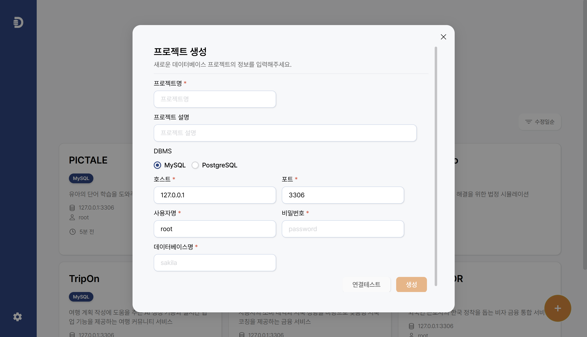
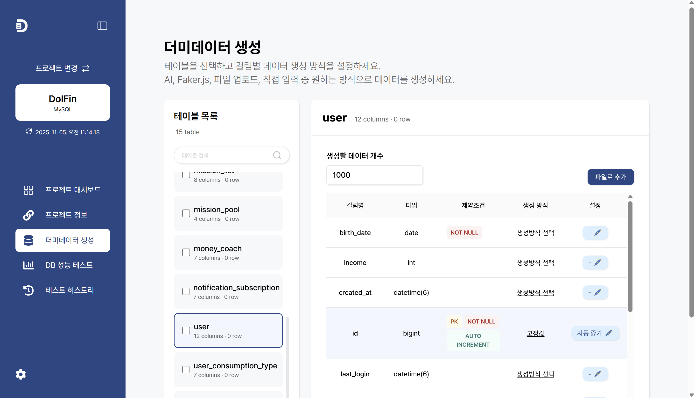
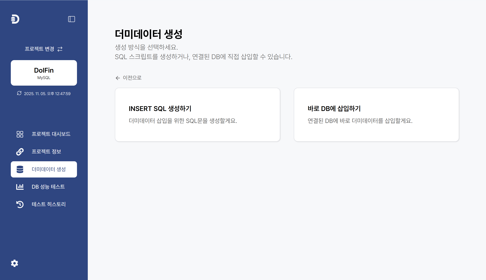

#  Here's Dummy

데이터베이스 스키마를 자동으로 분석하고 고품질 더미 데이터를 생성해주는 데스크탑 애플리케이션입니다.


## ✨ 주요 기능

### 🔌 다중 데이터베이스 지원

> MySQL, PostgreSQL을 연결할 수 있어요

### 📊 스키마 자동 분석

> 테이블 구조와 관계를 자동으로 파악해요

### ⚡ 대량 더미 데이터 생성

> Faker 생성 방식을 선택하면 10만개의 데이터를 약 10초만에 생성할 수 있어요!

### 🤖 AI 기반 데이터 생성

> Claude, GPT, Gemini를 활용해 똑똑한 데이터를 생성해요!

### 📁 파일 기반 데이터 삽입

> 수집한 오픈데이터를 우리 DB에 맞게 편하게 삽입해요!

## 🚀 빠른 시작

### 다운로드 및 설치

최신 릴리스는 [Releases 페이지](https://github.com/yuja201/here-is-dummy/releases)에서 다운로드하실 수 있습니다.

#### Windows

- `HeresDummy-Setup-{version}.exe` 다운로드 후 실행
- 설치 마법사를 따라 진행

#### macOS

- `HeresDummy-{version}.dmg` 다운로드
- DMG 파일을 열고 애플리케이션 폴더로 드래그

#### Linux

- `HeresDummy-{version}.AppImage` 다운로드
- 실행 권한 부여: `chmod +x HeresDummy-{version}.AppImage`
- 실행: `./HeresDummy-{version}.AppImage`

## 📖 사용 방법

### 1. 프로젝트 생성 (데이터베이스 연결)

1. 애플리케이션 실행 후 `+` 버튼 클릭
2. 데이터베이스 유형 선택 (MySQL, PostgreSQL)
3. 연결 정보 입력 (호스트, 포트, 사용자명, 비밀번호, 데이터베이스명)
4. `연결 테스트` 후 `연결`
   

### 2. 스키마 가져오기

- 연결된 데이터베이스의 테이블 목록이 자동으로 표시됩니다
- 더미 데이터를 생성할 테이블을 선택하세요
  

### 3. 데이터 생성 방식 선택

- 테이블의 칼럼별 데이터 생성 방식을 선택하세요

#### Faker 생성

- 사전 정의된 데이터 타입 선택
- 이름, 이메일, 전화번호, 주소 등 다양한 형식 지원
  

#### AI 생성

- 사전 정의된 데이터 타입 선택
- Claude, GPT, OpenAI 중 선택
- API 키 입력
- 컨텍스트에 맞는 데이터 자동 생성

#### 파일 업로드

- `파일로 추가` 버튼을 눌러 CSV, TXT, JSON 파일 업로드
- 컬럼 매핑 후 실제 데이터 패턴 기반 생성
  

### 4. 데이터 생성 및 내보내기

1. 생성할 레코드 수 지정
2. `데이터 생성` 클릭
3. SQL문을 출력하거나 바로 DB에 삽입하기
   
   

## 🛠️ 기술 스택

### Core

- **Electron** v38.4.0
- **React** v19.1.1
- **TypeScript** v5.9.2
- **Vite** v7.1.6

### Database Drivers

- **mysql2**
- **pg**

### AI & Data Generation

- **@anthropic-ai/sdk**
- **openai**
- **@google/generative-ai**
- **@faker-js/faker**

### State Management & Routing

- **zustand**
- **react-router-dom**

## 💻 개발자용 가이드

### 요구사항

- Node.js 18 이상
- npm 또는 yarn

### 설치 및 실행

```bash
# 저장소 클론
git clone https://github.com/yuja201/here-is-dummy.git
cd heresdummy

# 의존성 설치
npm install

# 개발 모드 실행
npm run dev

# 타입 체크
npm run typecheck

# 린트
npm run lint

# 포맷팅
npm run format
```

### 빌드

```bash
# 전체 빌드
npm run build

# 플랫폼별 빌드
npm run build:win     # Windows
npm run build:mac     # macOS
npm run build:linux   # Linux

# 압축 해제 빌드 (테스트용)
npm run build:unpack
```

### 프로젝트 구조

```
heresdummy/
├── src/
│   ├── main/          # Electron 메인 프로세스
│   ├── renderer/      # React UI 코드
│   └── preload/       # Preload 스크립트
├── resources/         # 앱 아이콘, 리소스
├── out/               # 빌드 결과물
└── dist/              # 배포용 패키지
```

## 🤝 기여하기

~~기여를 환영합니다! 자세한 내용은 [CONTRIBUTING.md](./docs/CONTRIBUTING.md)를 참고해주세요.~~

현재는 개발 진행 중인 관계로 기여를 받지 않고 있습니다.

### 버그 리포트 및 기능 제안

[Issues](https://github.com/yuja201/here-is-dummy/issues)에서 버그 리포트나 기능 제안을 남겨주세요.

## 📝 라이선스

이 프로젝트는 MIT 라이선스 하에 배포됩니다. 자세한 내용은 [LICENSE](./LICENSE) 파일을 참고하세요.

```
MIT License

Copyright (c) 2025 yuja
```

## 📞 문의 및 지원

- 이슈 트래커: [GitHub Issues](https://github.com/yuja201/here-is-dummy/issues)
- 소통 창구: [Google Forms](https://forms.gle/ehjfVpaeZMGxTcoU7)

## 🙏 감사의 말

이 프로젝트는 다음 오픈소스 라이브러리를 사용합니다:

- [Electron](https://www.electronjs.org/)
- [React](https://react.dev/)
- [Faker.js](https://fakerjs.dev/)
- [Node.js](https://nodejs.org/)

---

⭐ 이 프로젝트가 유용하다면 Star를 많이 많이 눌러주세요!

## ☕ 후원하기

만약 저희의 서비스가 도움이 되셨다면, 아래 버튼으로 커피 한 잔 부탁드립니다. 😄

[](https://www.buymeacoffee.com/heresdummy)
